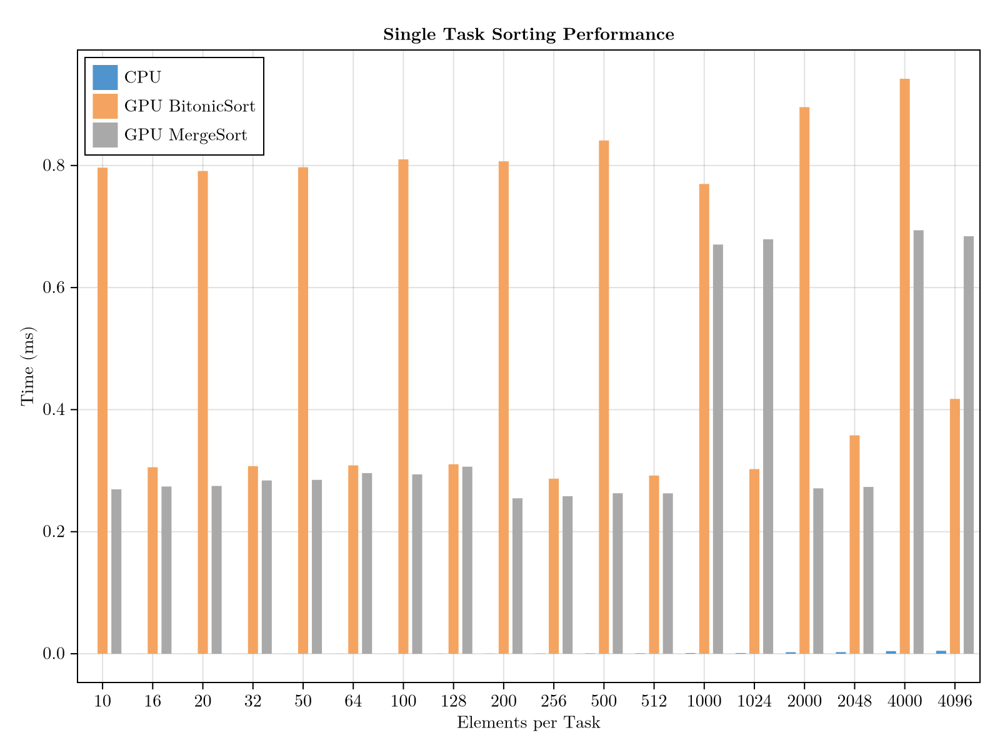
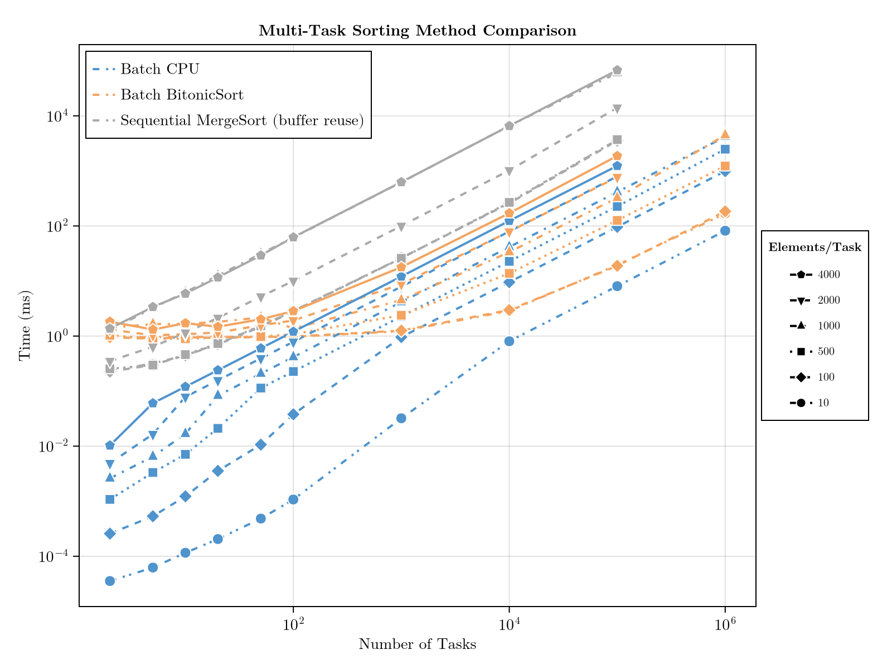

# BitonicSort.jl

[](https://github.com/WilliBee/BitonicSort.jl/actions/workflows/CI.yml?query=branch%3Amain)

A backend-agnostic GPU sorting library for Julia implementing bitonic sort networks with efficient batch processing.

Adapted from original CUDA C++ [radik](https://github.com/leefige/radik/) implementation.

## Features

- **Backend-agnostic GPU implementation** using [KernelAbstractions.jl](https://github.com/JuliaGPU/KernelAbstractions.jl) and [KernelIntrinsics.jl](https://github.com/WilliBee/KernelIntrinsics.jl)
- **Multi-backend support**: CUDA, Metal, ROCm, oneAPI, and more
- **Batch sorting**: Sort multiple independent arrays in a single kernel launch
- **In-place sorting** with index tracking
- **Custom comparators**: Support for `lt`, `by`, `rev`, `order` parameters (like Base.sort!)
- **NaN handling**: NaN values automatically pushed to the end
- **Broad type support**: Float16, Float32, Float64, Int16, Int32, Int64, and custom types
- **Optimized** for power-of-2 sizes up to 4096 elements

## Installation

```julia
using Pkg
Pkg.add("BitonicSort")
```

### Backend Requirements

BitonicSort.jl supports all GPU backends available through [KernelAbstractions.jl](https://github.com/JuliaGPU/KernelAbstractions.jl) and [KernelIntrinsics.jl](https://github.com/WilliBee/KernelIntrinsics.jl):

Example:
```julia
# For Apple Silicon
using Pkg
Pkg.add("Metal")

# For NVIDIA GPUs
Pkg.add("CUDA")
```

## Quick Start

### Single Array Sorting

```julia
using BitonicSort
using Metal  # or CUDA, AMDGPU, oneAPI

# Create GPU arrays
backend = MetalBackend()
values = MtlArray{Float32}(randn(256))
indices = MtlArray{Int32}(1:256)

# Sort in ascending order (default)
bitonic_sort!(values, indices)

# Sort in descending order
bitonic_sort!(values, indices; rev=true)

# Sort with custom comparator (e.g., by absolute value)
bitonic_sort!(values, indices; lt=(a, b) -> abs(a) < abs(b))

# Sort with transformation
bitonic_sort!(values, indices; by=abs)
```

### Multiple Arrays (Batch Sorting)

```julia
# Sort 3 arrays of different lengths in one kernel launch
len_1, len_2, len_3 = 256, 128, 64
total_elements = len_1 + len_2 + len_3

values = MtlArray{Float32}(randn(total_elements))
indices = MtlArray{Int32}(1:total_elements)

# Define task offsets
task_offsets = [0, len_1, len_1+len_2, total_elements]

# Sort all tasks at once
bitonic_sort!(values, indices; task_offsets=task_offsets)
```

## API Reference

### `bitonic_sort!(val_in, idx_in; lt=isless, by=identity, rev=nothing, order=Base.Order.Forward, task_offsets=Int64[])`

Sort values and indices using bitonic sort network. Compatible with Julia's Base.sort! API.

**Arguments:**
- `val_in::AbstractArray`: Values to sort (modified in-place, must be 1D)
- `idx_in::AbstractArray`: Indices to sort alongside values (modified in-place, must be 1D)
- `lt=isless`: Less-than comparison function
- `by=identity`: Transformation function
- `rev=nothing`: Reverse sort order (true=descending, false=ascending, nothing=default)
- `order=Base.Order.Forward`: Ordering specification
- `task_offsets=Int64[]`: Optional offsets for multi-task sorting.
  For N tasks, provide N+1 offsets: `[0, len1, len1+len2, ...]`.

**Constraints:**
- Each task must have ≤ 4096 elements
- Optimized for power-of-2 sizes (2, 4, 8, ..., 1024, 2048, 4096)
- Arrays must be on GPU (MtlArray, CuArray, etc.)

**Returns:**
- `val_in`: Sorted values (modified in-place)
- `idx_in`: Sorted indices (modified in-place)

**Examples:**
```julia
# Ascending sort (default)
bitonic_sort!(values, indices)

# Descending sort
bitonic_sort!(values, indices; rev=true)

# Custom comparator
bitonic_sort!(values, indices; lt=(a, b) -> abs(a) < abs(b))

# With transformation
bitonic_sort!(values, indices; by=abs)

# Batch sorting
bitonic_sort!(values, indices; task_offsets=[0, 256, 512])
```

## Performance

**Design Characteristics:**
- Optimized for power-of-2 sizes up to 4096 elements per task
- Non-power-of-2 sizes require padding, adding processing overhead
- Best use case: batch sorting multiple independent arrays simultaneously
- Consistent performance regardless of data distribution
- Limited to 4096 elements per task by design

**Benchmark Results**

Comparison against AcceleratedKernels.merge_sort_by_key! (GPU) and Julia's built-in `sort!` (CPU). Benchmarks run on Apple M4 with 24GB unified memory:

<div style="display: flex;">
  
  
</div>

Running benchmarks:
```bash
julia --project=benchmark benchmark/generate_results.jl
julia --project=benchmark benchmark/plot_results.jl
```

## Testing

Run the test suite:

```bash
BACKEND=metal julia --project=. -e 'using Pkg; Pkg.test()'
BACKEND=cuda julia --project=. -e 'using Pkg; Pkg.test()'
```

## TODO

- [ ] Native 2D array support (column-wise sorting)
- [ ] Expand maximum task size beyond 4096 elements
- [ ] Additional backend-specific optimizations ?

## References and Acknowledgments

**Bitonic Sort:**
- Batcher, K. E. (1968). "Sorting networks and their applications"
- Original algorithm designed for parallel sorting hardware

## Special Thanks

We are deeply grateful to:

**Original CUDA C++ Implementation:**
- [RadiK](https://github.com/leefige/radik/)
- Li, Y., Zhou, B., Zhang, J., Wei, X., Li, Y., & Chen, Y. (2024). "RadiK: Scalable and Optimized GPU-Parallel Radix Top-K Selection." *Proceedings of the 38th ACM International Conference on Supercomputing*

**Foundational JuliaGPU Ecosystem:**
- [KernelAbstractions.jl](https://github.com/JuliaGPU/KernelAbstractions.jl) - The foundational backend-agnostic GPU kernel framework that makes portable GPU programming possible
- [KernelIntrinsics.jl](https://github.com/epilliat/KernelIntrinsics.jl) - The awesome library providing essential warp-level GPU intrinsics (shuffles, vload, etc.)
- [JuliaGPU](https://github.com/JuliaGPU) - The incredible community driving GPU computing innovation in Julia

**Backend Packages:**
- [Metal.jl](https://github.com/JuliaGPU/Metal.jl) - Apple Silicon GPU backend
- [CUDA.jl](https://github.com/JuliaGPU/CUDA.jl) - NVIDIA GPU backend
- [AMDGPU.jl](https://github.com/JuliaGPU/AMDGPU.jl) - AMD GPU backend
- [oneAPI.jl](https://github.com/JuliaGPU/oneAPI.jl) - Intel GPU backend

## License

MIT License

## Contributing

Contributions are welcome! Please feel free to submit a Pull Request.
